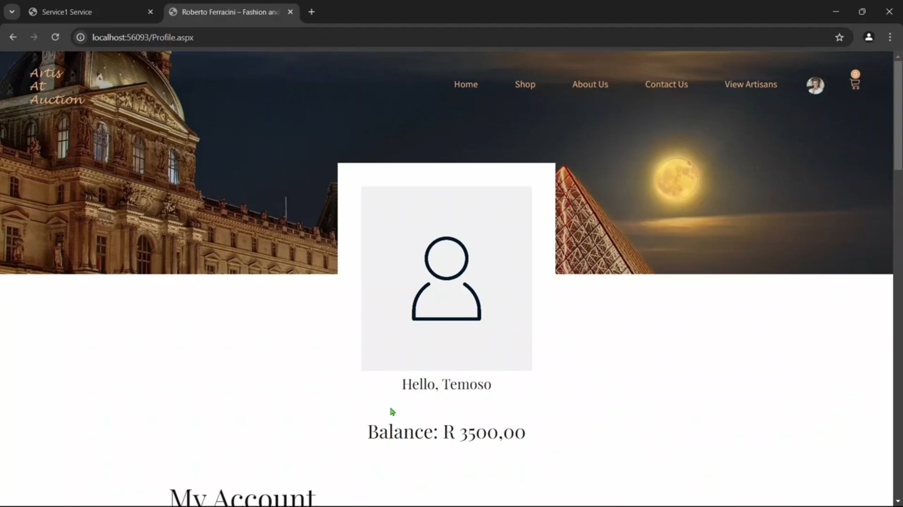
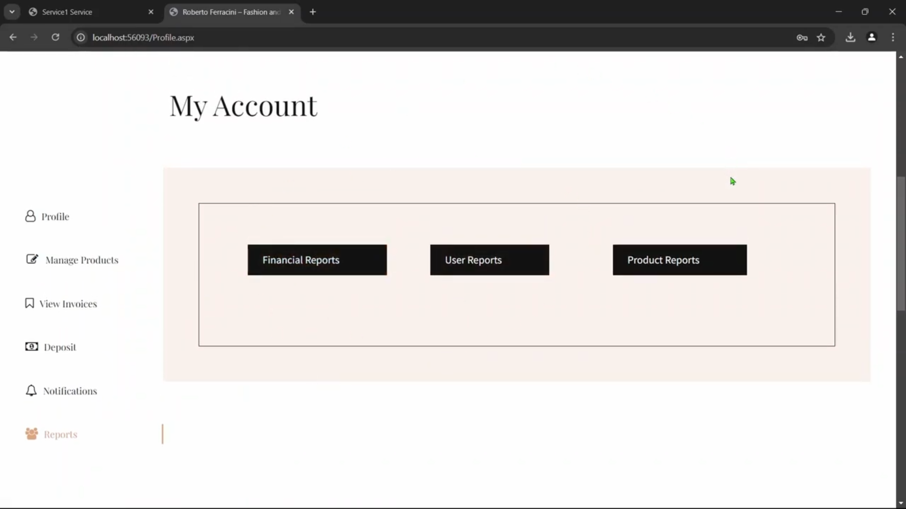

# Project Overview

This project is an ASP.NET Web Forms application that serves as an e-commerce platform for artisans. It allows artisans to register, list their products (art, accessories, clothing), and sell them through an auction-based system. Users can browse products, place bids, and purchase items. The application also includes features like a shopping cart, wishlist, user profiles, and order management.

The application follows a client-server architecture, where the ASP.NET front-end communicates with a WCF service for all data operations.

## Key Technologies

*   **Frontend:** ASP.NET Web Forms, HTML, CSS, JavaScript, jQuery, Bootstrap
*   **Backend:** C#, WCF (Windows Communication Foundation)
*   **Database:** SQL Server (LocalDB) with LINQ to SQL

# Building and Running

This project contains two separate Visual Studio solutions that must be run in a specific order.

### 1. Backend (WCF Service)

1.  **Open the solution:** Open the `Art_Backend\Art_Backend.sln` file in Visual Studio.
2.  **Build the solution:** Build the solution by pressing `Ctrl+Shift+B` or by selecting "Build > Build Solution" from the menu.
3.  **Run the service:**
    *   Set the `Art_Backend` project as the startup project.
    *   Press `F5` to start the service. This will launch the WCF Test Client.
    *   The service will be hosted at `http://localhost:14011/Service1.svc`.

### 2. Frontend (ASP.NET Web Application)

1.  **Open the solution:** Open the `Project_Backup\Project_Backup.sln` file in Visual Studio.
2.  **WCF Service Dependency:** The application requires a running instance of the backend WCF service. The service endpoint is configured in `Project_Backup\Project_Backup\Web.config` to be `http://localhost:14011/Service1.svc`. **Make sure the backend service is running before launching the web application.**
3.  **Run the Application:** Once the solution is open and the WCF service is running, you can start the application by pressing `F5` or clicking the "Start Debugging" button in Visual Studio. This will build the project and open the website in your default browser.

# Development Conventions

## Frontend (Project_Backup)

*   **Web Forms:** The project uses the ASP.NET Web Forms model, with `.aspx` files for the user interface and corresponding `.aspx.cs` code-behind files for server-side logic.
*   **Master Page:** The overall site layout and structure are defined in the `Site.Master` file. All other pages inherit from this master page.
*   **WCF Service Client:** The application communicates with the backend WCF service using a generated client proxy (`Service1Client`). All data access is performed through this client.
*   **Static Assets:** CSS, JavaScript, and images are located in the `assets` directory.

## Backend (Art_Backend)

*   **Data Access:** Data access is performed using LINQ to SQL. The `DatabaseDataContext` class is used to query and update the database.
*   **Service Operations:** All service operations are defined in the `IService1` interface and implemented in the `Service1` class.
*   **Data Transfer:** DTOs are used to pass data between the client and the service. This helps to decouple the service's internal data model from the data model exposed to clients.
*   **Configuration:** The database connection string and other service settings are stored in the `Web.config` file.

# Application Screenshots

Below are some screenshots of the application, showcasing its features and user interface.

### Home Page

### User Profile

### Account Details

### Seller Details

### Product Listings

### Product Details

### Bidding Interface

### Shoppping Cart

### Order Summary

### Shipping Details

### Completed Order

### Notifications

### Invoices

### Seller Registration

### Payment Details

### Artwork Upload

### Artwork Details

### Admin Dashboard

### Reports and Analytics

